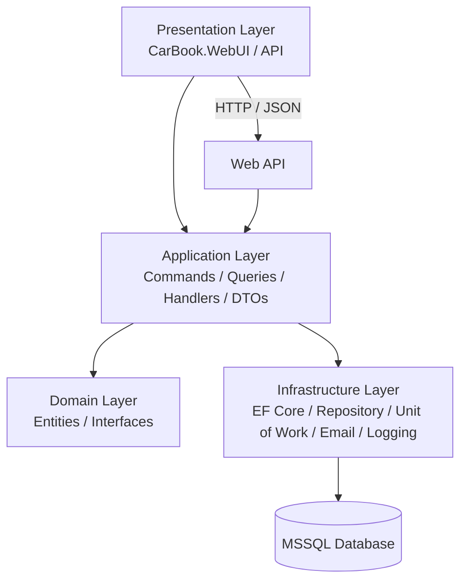

<div align="center">

# 🚗 **CarBook – Araç Kiralama Web Uygulaması**
Modern Mimari • CQRS • Mediator • Repository Pattern • JWT • SignalR

---

### 🌐 Kurumsal seviye mimari ile geliştirilmiş profesyonel araç kiralama platformu

</div>

---

## 📌 Proje Hakkında

CarBook, modern yazılım geliştirme standartlarına göre inşa edilmiş, ölçeklenebilir ve güvenli bir araç kiralama yönetim sistemidir.  
Kullanıcılar araçları görüntüleyebilir, detaylara bakabilir, rezervasyon yapabilir; yöneticiler ise güçlü admin paneli üzerinden tüm işlemleri yönetebilir.

---

## 🧩 Kullanılan Mimariler ve Tasarım Desenleri

- **CQRS (Command & Query Responsibility Segregation)**
- **Mediator Pattern (MediatR)**
- **Repository Pattern**
- **Onion Architecture**
- **JWT Authentication**
- **SignalR Real-time Communication**
- **SOLID Principles**

---

## 🛠 Kullanılan Teknolojiler

### 🔹 Backend
- ASP.NET Core 8
- Entity Framework Core
- MediatR
- AutoMapper
- FluentValidation
- MSSQL Server
- JWT Token
- SignalR
- LINQ
- Swagger

### 🔹 Frontend
- ASP.NET MVC
- Bootstrap 5
- HTML5 / CSS3
- jQuery – AJAX
- SweetAlert2
- Responsive Tasarım

### 🔹 DevOps & Araçlar
- Git / GitHub
- Postman
- Swagger UI

---

## 🚀 Proje Özellikleri

- Araç listeleme, filtreleme ve detay sayfası  
- Kullanıcı kaydı, JWT tabanlı giriş  
- Rezervasyon oluşturma ve yönetimi  
- Yorum ve değerlendirme sistemi  
- Admin paneli (araç, kategori, rezervasyon, kullanıcı yönetimi)  
- SignalR ile anlık araç sayısı görüntüleme  
- İstatistik panelleri  
- API – MVC arayüz ayrımı  
- Modern responsive UI  

---


## 📸 Proje Ekran Görüntüleri

<div align="center">

<table>
  <tr>
    <td></td>
    <td></td>
    <td></td>
    <td></td>
  </tr>

  <tr>
    <td></td>
    <td></td>
    <td></td>
    <td></td>
  </tr>

  <tr>
    <td></td>
    <td></td>
    <td></td>
    <td></td>
  </tr>

  <tr>
    <td></td>
    <td></td>
    <td></td>
    <td></td>
  </tr>

  <tr>
    <td></td>
    <td></td>
    <td></td>
    <td></td>
  </tr>

  <tr>
    <td></td>
    <td></td>
    <td></td>
    <td></td>
  </tr>

  <tr>
    <td></td>
    <td></td>
    <td></td>
    <td></td>
  </tr>

  <tr>
    <td></td>
    <td></td>
    <td></td>
  </tr>

</table>

</div>

---

# 🧱 Projede Kullanılan Mimariler ve Teknolojiler  
Bu proje, *Udemy – ASP.NET Core API 8 Onion Architecture ile BookCar Projesi* eğitimindeki mimari standartlar ve modern kurumsal yazılım geliştirme yaklaşımları temel alınarak geliştirilmiştir.

---

## 🧩 Kullanılan Mimari Yaklaşımlar

### 🔹 **Onion Architecture**
- Projenin merkezi Domain katmanıdır.  
- Domain, altyapıdan tamamen bağımsızdır.  
- Uygulama katmanı, iş kurallarını içerir; altyapı detaylarına bağımlı değildir.  
- Dış katmanlar merkeze bağımlıdır, merkez dış katmanlara **bağımlı değildir**.

### 🧅 Onion Architecture Nedir?

Onion Architecture, yazılım projelerinde bağımlılıkları merkezden dışa doğru düzenleyen, domain odaklı bir mimari modeldir.
Bu mimaride en içte Domain (iş kuralları) bulunur ve dış katmanlar iç katmanlara bağımlıdır;
ancak iç katmanlar hiçbir zaman dış katmanlara bağımlı olmaz.

| Onion Architecture | Layered View |
|-------------------|--------------|
|  |  |

### **Uygulamadaki Temel Katmanlar**
- Domain Layer        → Çekirdek (Entities, Interfaces, Value Objects)
- Application Layer   → İş kuralları, CQRS, DTO, Handler
- Infrastructure      → EF Core, Repository, UnitOfWork, Email, JWT
- Presentation        → API veya MVC Arayüzü


Bu sayede:

💠 Kod daha test edilebilir olur

💠 Katmanlar arasında sıkı bağlılık ortadan kalkar

💠 Altyapı bağımlılıkları (EF Core, Email, Logging vs.) domain katmanına sızmaz

💠 Uzun vadede bakım maliyeti azalır

💠 Büyük ölçekli projeler için güçlü ve temiz bir yapı sağlar

### 🔹 **Clean Architecture Prensipleri**
- Bağımlılık kuralları merkeze doğru akar.  
- Use-case'ler Application katmanında izole edilir.  
- Her katmanın tek bir sorumluluğu vardır.

### 🔹 **CQRS (Command & Query Responsibility Segregation)**
- Yazma işlemleri (Commands) ile okuma işlemleri (Queries) tamamen ayrılmıştır.  
- Kod okunabilirliği, test edilebilirlik ve performans artışı sağlar.

### 🔹 **Mediator Pattern (MediatR)**
- Tüm istekler Handler’lar üzerinden yönetilir.  
- Controller’larda gereksiz iş mantığı bulunmaz.  
- Request → Handler → Response akışı tam ayrıştırılmıştır.

### 🔹 **Repository Pattern + Unit of Work**
- Veri erişimi soyutlanmıştır.  
- EF Core bağımlılığı Application katmanına sızmaz.  
- Tüm DB operasyonları tek noktadan yönetilebilir.

---

## 🛠 Kullanılan Teknolojiler

### 🔹 Backend
- .NET 8 (Asp.Net Core API)
- C#
- Entity Framework Core 8
- MediatR
- AutoMapper
- FluentValidation
- Repository + Unit of Work Pattern
- MSSQL Server
- JWT Authentication
- SignalR (Gerçek Zamanlı Araba Sayısı Bilgisi)
- Swagger
- LINQ

### 🔹 Frontend
- ASP.NET MVC
- Bootstrap 5
- jQuery – AJAX
- SweetAlert2
- HTML5 / CSS3 (Responsive UI)

### 🔹 DevOps & Araçlar
- Git & GitHub
- Postman
- Swagger UI

---

# 🧩 Tam Mimari Şema (Mermaid Diagram)



🧱 ASCII Formatlı Mimari Haritası
```

CarBook Solution
│
├── Presentation (API + WebUI)
│     ├── Controllers
│     └── Views / Razor / MVC
│
├── Application Layer
│     ├── Commands
│     ├── Queries
│     ├── Handlers
│     ├── Interfaces
│     ├── DTOs
│     └── Validators
│
├── Domain Layer
│     ├── Entities
│     ├── Value Objects
│     └── Domain Interfaces
│
└── Infrastructure Layer
      ├── Repository Implementations
      ├── UnitOfWork
      ├── DbContext (EF Core)
      ├── JWT - Auth
      ├── Email Services
      ├── Logging
      └── MSSQL Database
```

## 🚀 Kurulum Adımları

### **1️⃣ Projeyi Klonla**
```bash
git clone https://github.com/Suaybhizar/CarBook.git
```
### **2️⃣ AppSettings Dosyasını Yapılandır**
```json
"ConnectionStrings": {
  "DefaultConnection": "Server=.;Database=CarBookDb;Trusted_Connection=True;TrustServerCertificate=True;"
}
```
### **3️⃣ Migration Oluştur & Veritabanını Kur**
```powershell
add-migration InitialCreate
update-database
```
### **4️⃣ Uygulamayı Çalıştır**
```bash
dotnet run
```
